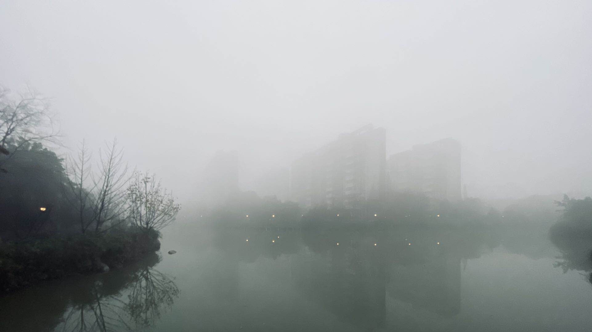

点击可以播放音乐：

<audio id="audio" controls="" preload="none">
      <source id="mp3" src="https://music.163.com/song/media/outer/url?id=472045266.mp3">
</audio>

去年也是大约这个时间，考试还剩最后一门，那天我凌晨即起，早有大雾，我闲逛到九州桥上，拍下了这张照片：

明天加油！最后的查询语句做完**一定要仔细检查两遍！**

考完见😁！

**视频测试：**

<iframe 
  src="//player.bilibili.com/player.html?aid=203291798&bvid=BV13h411f79D&cid=270735676&page=1&high_quality=1&danmaku=0" 
    allowfullscreen="allowfullscreen" 
    width="100%" 
    align="middle" 
    scrolling="no" 
    frameborder="0" 
    sandbox="allow-top-navigation 
             allow-same-origin 
             allow-forms 
             allow-scripts"
></iframe>

