Last updated: July 18 2022


## 前言

### 项目简介

一个用LinuxC实现基于UDP协议的一个多人聊天小程序。网上java实现比较多，LinuxC的实现也有，但解说不够详细。所以在这里分享一下我自己的一些设计思路。一些设计不足之处，也恳请大家见谅，如果能提出宝贵意见，则不胜感激。

完成这篇文章的主要目的是想分享一些关于简单的网络编程以及C/S架构编程的思路给学弟学妹，希望看到后能对你们有所帮助，希望让你们心动不仅仅是源码的复制粘贴。

文章偏长，针对你所需要的浏览，希望你能找到你想要的内容。当然如果你对聊天程序没有任何思路，希望你能通篇浏览，这样更成体系一些。如果你已经有了一些思路，那就取其精华去其糟粕。

### 运行环境

操作系统：

​		Linux内核版本：Linux version 5.13.0-52-generic

​		Ubuntu版本：Ubuntu 9.4.0-1ubuntu1

代码运行环境：

​		编译器版本：gcc version 9.4.0

​		编辑器版本：May 2022 (version 1.68)


### 关于玩法

这个小程序的玩法很简单！

1. 修改客户端程序中的服务器IP地址。
   ```C
   sockfd = socket(AF_INET, SOCK_DGRAM, 0); //创建套接字对象，打开网络通信端口
   //设置服务器地址
   bzero(&servaddr, sizeof(servaddr));					       //结构体置零
   servaddr.sin_family = AF_INET;						       //设置协议
   inet_pton(AF_INET, "127.0.0.1", &servaddr.sin_addr); //设置服务端IP地址，在这里修改服务器的IP地址。
   servaddr.sin_port = htons(SERV_PORT);				       //设置端口号
   ```
   127.0.0.1为本机的IP地址，即本机当作服务端。当然可以本机既是服务端又是客户端。<br>
   如果使用其他电脑当作服务器或者远程服务器（真正的服务器），则需要修改成服务器的IP地址。<br>
   假如是第一种情况，你和你的朋友一起玩这个小程序，那么必须连接在同一个局域网下。再启动程序之前，先ping通。<br>
   如果是后者，你买了个远程服务器的话，可以将服务器程序放在远程服务器上，让它一直运行。远程服务器的IP地址为公网IP，所有人都可以访问到。
2. 使用服务器中预留的用户名+密码登陆

   | 用户名     | 密码  |
   | ---------- | ----- |
   | 寂寞的忧伤 | 123   |
   | 暴龙战士   | 12345 |
   | 阿龙       | qwer  |
   | 仙女小樱   | yyy   |
   | xiaozhang  | 123   |

3. 然后就可以通过使用指令`to + 用户名 + 消息`给这个用户发消息，中间用空格隔开。

4. 或者使用指令`toall + 消息`来群发消息，中间用空格隔开。

5. 最后使用指令`logout`来退出程序。
### 程序测试
经测试，该程序仅能运行在Linux操作系统中，可通过连接同一局域网(同一热点或WIFI)进行通信；或者，将服务端程序部署到公网服务器，则可实现远距离通信。如果手机装有C语言编译器IDE，也可实现手机终端的通信。

## 命令及实例

### 相关命令

1. 登陆(login)：客户端输入用户名和密码登陆。

2. 私发(to <用户名> <消息>)：通过 to+用户名+消息指令给指定用户发送消息。

3. 群发(toall <消息>)：通过toall+消息群发所有在线用户。

4. 退出登陆(logout)：将用户状态置于下线。

### 实例

<iframe src="http://114.116.110.230:1000" width="100%" style="border:none;display:block;height:50vh;"></iframe>

## 设计思路及细节

### 思路图

关于服务端和客户端的通信流程，想必大家早已掌握，这里不再多加赘述。

下面是我程序的大体设计思路：

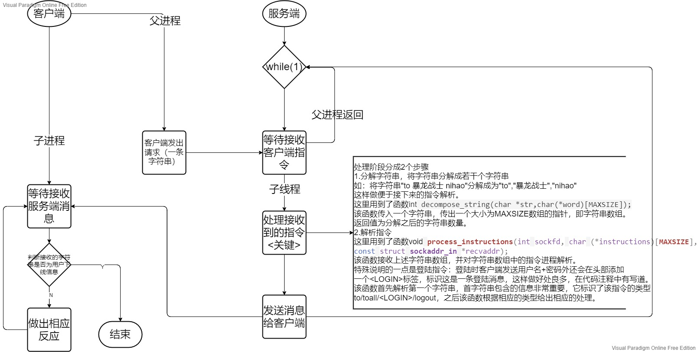

### 细节

#### 登陆细节

在我设计的程序中，用户的信息以全局结构数组存储在服务端。

**关于用户信息的结构体定义：**

```C
typedef struct                   //用户结构体
{
	char *username;				 //用户名
	char *password;				 //密码
	int mark;					 //仅仅是用来判断用户是否存在，用于判断当前用户的数量
	struct sockaddr_in useraddr; //用户IP/端口地址,用户一般使用sockaddr_in来设置套接字地址，sockaddr一般是操作系统使用。
	int mode;					 //记录用户状态 0~下线,1~上线
} User;
```

**用户信息的存储方式：**

```C
User UserInfos[USER_COUNT] = {{"寂寞的忧伤", "123", 1}, {"暴龙战士", "12345", 1}, {"阿龙", "qwer", 1}, {"仙女小樱", "yyy", 1},{"xiaozhang","123",1}}; //用户列表,最多20个用户
```

在用户的信息中指出了当前程序中预留的一些用户名以及密码，当然如果你想也可以自己加入一些你自己定义的用户名和密码。

注意：格式要与上面列表保持一致。其中第三个成员mark要设置为1.

**登陆验证：**

1. 首先客户端将输入的用户名和密码组合在一起，并且在开头加上\<LOGIN>标签，标识该字符串是一个登陆指令。中间均用空格隔开，然后将该字符串发送给服务端。

   显示效果：

   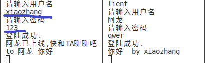

   代码实现：

   ```C
   char login_info[60] = "<LOGIN> ";                        //登陆标签
   	strcat(login_info,argv);
   	strcat(login_info, " "); //在用户名和密码之间插入一个间隔符号（空格）
   	strcat(login_info, password);
   	//登陆验证
   	sendto(sockfd, login_info, strlen(login_info) + 1, 0, (struct sockaddr *)&servaddr, sizeof(servaddr)); //向服务端请求登陆验证
   ```

2. 服务端接收并进行验证，如果验证成功发送消息给客户端和其他在线用户。

   实现效果：

   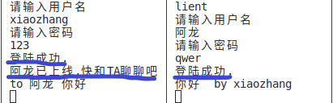

   代码实现：

   ```C
   case LOGIN: //处理登陆操作
   		//判定用户名是否存在，如果存在锁定该用户信息
   		for (i = 0; i < user_current_count; i++)           //比对次单词是不是用户名
   		{
   	 		if (strcmp(UserInfos[i].username, pp[1]) == 0) //通过用户名匹配登陆用户的信息
   	 		{
   	 			break;
   	 		}
   		}
   		//首先检验用户名是否存在？
   		if(i==user_current_count)           //如果不存在
   		{
   			printf("用户名:%s不存在\n", pp[1]);
   			sendto(sockfd, "该用户名不存在.\n", sizeof("该用户名不存在.\n"), 0, (struct sockaddr *)recvaddr, sizeof(*recvaddr));
   			break;
   		}
   		
   		//检验密码是否正确
   		if (strcmp(UserInfos[i].password, pp[2]) != 0)
   		{
   			printf("用户:%s密码错误\n", UserInfos[i].username);
   			sendto(sockfd, "登陆失败，密码错误.\n", sizeof("登陆失败，密码错误.\n"), 0, (struct sockaddr *)recvaddr, sizeof(*recvaddr));
   			break;
   		}
   		
   		char str_ip[INET_ADDRSTRLEN]; //长度正好是IPv4的字符串长度正好16.
   		//如果密码错误，不会导致该用户下线。
   		//异地登陆成功的话
   		if (UserInfos[i].mode == 1)         //如果用户已经在线，该版本支持用户异地登陆，所以一定要保护好密码哟～
   		{
   			sendto(sockfd,"用户名被异地登陆，强制退出\n",sizeof("用户名被异地登陆，强制退出\n"),0,(struct sockaddr *)&UserInfos[i].useraddr,sizeof(UserInfos[i].useraddr));
   			printf("用户名:%s被IP地址:%s异地登陆，端口号为:%d.\n",UserInfos[i].username,
   				inet_ntop(AF_INET,&recvaddr->sin_addr,str_ip,sizeof(str_ip)),
   				ntohs(recvaddr->sin_port));
   			//sendto(sockfd, "登陆成功.\n", sizeof("登陆成功.\n"), 0, (struct sockaddr *)recvaddr, sizeof(*recvaddr));
   			//break;
   		}
   		
   		
   		//将用户的地址存入结构体中
   		UserInfos[i].useraddr = *recvaddr; //将用户的地址存入结构体中,再输出地址之前，必须先初始化UserInfos[i].useraddr.否则第一次输出的ip地址和端口号都是0
   		if(UserInfos[i].mode == 0)         //正常情况下的输入，防止异地登陆的二次输出，因为异地登陆的话，已经输出过。
   		{
   			printf("用户:%s已登陆,IP地址:%s,端口号:%d\n", UserInfos[i].username,
   				inet_ntop(AF_INET, &UserInfos[i].useraddr.sin_addr, str_ip, sizeof(str_ip)), //导出客户端的IP地址
   				ntohs(UserInfos[i].useraddr.sin_port));										 //导出客户端的端口号
   		}
   		UserInfos[i].mode = 1;			   //标志用户已上线
   		sendto(sockfd, "登陆成功.\n", sizeof("登陆成功.\n"), 0, (struct sockaddr *)recvaddr, sizeof(*recvaddr));
   
   		//向其他在线用户发送该用户以上线
   		char online_reminder[MAXSIZE];
   		sprintf(online_reminder, "%s已上线,快和TA聊聊吧\n", UserInfos[i].username);
   		sendmessage_toall(sockfd,i,online_reminder);
   ```

   上面的代码封装在函数**process_instructions**中，是该函数的登陆操作部分。

   在上面的验证操作中，包含了诸多情况分析：用户名错误、密码错误、用户名已在线（可以进行异地登陆）。

   验证成功后，用mode标志用户处于在线状态。并发送"登陆成功"给客户端，并给其他用户转发该用户的登陆消息。

3. 客户端接收到服务端的反馈，并进行显示。

   显示效果：

   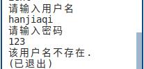

   代码实现：

   ```C
   	printf("%s", message_recv); //服务端发送的信息中包含\n和\0.
   	if(strcmp(message_recv,"该用户名不存在.\n")==0)
   	{
   		printf("(已退出)\n");
   		exit(-1);
   	}
   	if(strcmp(message_recv,"登陆成功.\n")==0)       //如果登陆成功
   	{
   		break;
   	}
   ```

   首先显示服务端发送的消息："登陆成功"/"该用户不存在"/"登陆失败，密码错误"，然后进行相应的处理。

#### 转发细节

首先客户端发送消息到服务器，再由服务器转发到相应的用户。因为所有用户信息都存储在服务端，所以客户端不能直接转发消息，必须由服务器进行转发。**以下操作均由服务端实现。**

1. 首先通过发送者的ip地址和端口号解析出发送者的用户名，并以后缀的形式合并消息语句后面。如图，服务器解析出发送者姓名xiaozhang并将by  xiaozhang合并在消息后面，转发时一并发送。

   显示效果：

   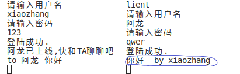

   代码实现：

   ```C
   case OPERATION: //处理发送消息和下线的指令需求
   	{
   		//用源用户的IP地址+端口号求出发送者的用户名
   		char username[20];			  //源用户名，即发送者的名字。
   		char sec_ip[INET_ADDRSTRLEN]; //存放源用户信息中的ip地址
   		char det_ip[INET_ADDRSTRLEN];
   		inet_ntop(AF_INET, &recvaddr->sin_addr, sec_ip, sizeof(sec_ip)); //将ip地址转化为字符串。
   		int sec_port = ntohs(recvaddr->sin_port);						 //导出源用户信息中的端口号
   		int i;
   		for (i = 0; i < user_current_count; i++)
   			if (ntohs(UserInfos[i].useraddr.sin_port) == sec_port && strcmp(inet_ntop(AF_INET, &UserInfos[i].useraddr.sin_addr, det_ip, sizeof(det_ip)), sec_ip) == 0)
   			{
   				strcpy(username, UserInfos[i].username);
   				break;
   			}
   
   		char suffix[40];
   		sprintf(suffix, "  by %s\n", username); //消息末尾的署名后缀
   ```

2. 如果是to指令，则找出用户名即指令中的第二个字符串，并通过用户名锁定用户的信息（用户状态、sockaddr_in结构体，包含IP地址&&端口号），然后将目标用户的sockaddr_in结构体的地址传入sendto函数，最终将消息转发给目标用户。

   如果目标用户不存在，或者不在线，服务端会将转发异常反馈给客户端。如果目标用户处于在线状态，那么它的sockadrr_in结构体一定可以找到，然后便可按上述操作执行。

   代码实现：

   ```C
   case 0: //关于指令"to",发送消息给指定用户
   {
       char *error_send[2] = {"用户不存在\n", "用户不在线\n"};
       int ii;
       for (ii = 0; ii < user_current_count; ii++) //查找目标用户，UserInfos[ii]表示的目标用户的用户信息
       {
           if (strcmp(UserInfos[ii].username, pp[1]) == 0)
               break;
       }
   
       if (ii == user_current_count) //发送的用户不存在
       {
           sendto(sockfd, error_send[0], strlen(error_send[0]) + 1, 0, (struct sockaddr *)recvaddr, sizeof(*recvaddr)); //发送错误信息到客户端
           break;
       }
       else if (UserInfos[ii].mode == 0)
       {
           sendto(sockfd, error_send[1], strlen(error_send[0]) + 1, 0, (struct sockaddr *)recvaddr, sizeof(*recvaddr)); //发送错误信息到客户端
           break;
       }
       //用户在线,发送信息
       strcat(pp[2], suffix);																								   //将后缀连接在消息后面
       sendto(sockfd, pp[2], strlen(pp[2]) + 1, 0, (struct sockaddr *)&UserInfos[ii].useraddr, sizeof(UserInfos[ii].useraddr)); //给目标用户发送信息
       break;
   }
   ```

3. 如果是toall指令，则遍历所有的在线用户（除了本身），取出sockaddr_in结构体地址通过sendto函数将消息转发到各个客户端。

   如果用户在线，则一定能取到相应sockaddr_in结构体的地址。

   代码实现：

   ```C
   case 2: //关于指令"toall",发送消息给所有在线用户
   			strcat(pp[1], suffix);
   			sendmessage_toall(sockfd,i,pp[1]);//群发消息函数
   ```

   sendmessage_toall函数实现：

   ```C
   void sendmessage_toall(int sockfd,int i,const char* mesg)//群发消息, i~标记，表示不给UserInfos[i]用户发消息，一般将i赋值为当前用户的i值。如果将i置为-1，则将消息发送给所有在线用户。     
   {
       for (int k = 0; k < user_current_count; k++)
       {
           if (k != i && UserInfos[k].mode == 1)
           {
               sendto(sockfd, mesg, strlen(mesg) + 1, 0, (struct sockaddr *)&UserInfos[k].useraddr, sizeof(UserInfos[k].useraddr));
               //发送消息到在线用户
           }
       }
   }
   ```

#### 下线细节

1. 客户端发送下线请求"logout"给服务端。

2. 服务端接收，并给出相应的处理。如，将用户的状态置于下线状态、给客户端及其他在线用户发送该用户的下线消息，同时在服务端也打印一条该用户的下线消息。

   代码实现：

   ```C
   case 1: //关于指令"logout",退出登陆
       printf("用户：%s已下线\n", username);
       UserInfos[i].mode = 0;
       char str[30];
       sendto(sockfd, "拜拜，欢迎下次再来\n", sizeof("拜拜，欢迎下次再来\n"), 0, (struct sockaddr *)recvaddr, sizeof(*recvaddr));
       char logout_mesg[60];
       sprintf(logout_mesg,"%s已下线,下次再找TA聊吧\n",username);
       sendmessage_toall(sockfd,i,logout_mesg);
       break;
   ```

3. 客户端收到服务端的反馈消息后，打印消息。由于客户端是子进程接收消息，当子进程接收到下线信息后，杀死父进程，客户端程序结束。

   代码实现：

   ```C
   while(1)                                   //子进程
   {
       recvfrom(sockfd, message_recv, sizeof(message_recv), 0, NULL, 0); //接受服务端发送的信息
       printf("%s", message_recv);
       if(strcmp(message_recv,"拜拜，欢迎下次再来\n")==0||strcmp(message_recv,"用户名被异地登陆，强制退出\n")==0)//程序唯一出口
       break;
   }
   kill(getppid(),SIGKILL);//子进程直接发送2号信号给父进程，父进程直接终止
   ```

   其中"拜拜，欢迎下次再来\n"就是服务端发送给客户端的下线消息。上述代码中除了下线外，还有异地登陆也会导致子进程杀死父进程导致客户端程序终止。关于异地登陆的情况我刚在其他细节中给大家讲述。

下线操作的显示效果：

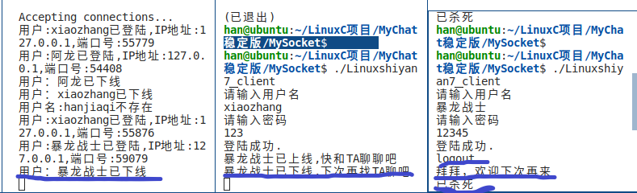

#### 其他细节

1. 异地登陆
   该程序允许异地登陆即当登陆用户名已在线时，如果密码输入正确可以登陆成功。异地登陆成功后服务端便会发送消息"用户名被异地登陆，强制退出\n"给之前的客户端，收到后客户端终止，同时也在服务端打印一条该用户的异地登陆消息。

   显示效果：

   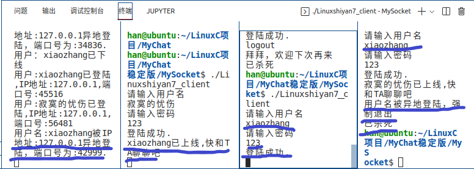

   代码实现：

   ```C
   //服务端
   if (UserInfos[i].mode == 1)         //如果用户已经在线，该版本支持用户异地登陆，所以一定要保护好密码哟～
   {
           sendto(sockfd,"用户名被异地登陆，强制退出\n",sizeof("用户名被异地登陆，强制退出\n"),0,(struct sockaddr *)&UserInfos[i].useraddr,sizeof(UserInfos[i].useraddr));
           printf("用户名:%s被IP地址:%s异地登陆，端口号为:%d.\n",UserInfos[i].username,
                  inet_ntop(AF_INET,&recvaddr->sin_addr,str_ip,sizeof(str_ip)),
                  ntohs(recvaddr->sin_port));
           //sendto(sockfd, "登陆成功.\n", sizeof("登陆成功.\n"), 0, (struct sockaddr *)recvaddr, sizeof(*recvaddr));
           //break;
   }
   ```

   当客户端子进程收到"用户名被异地登陆，强制退出\n"后，便会杀死父进程，客户端终止。

2. 避免Ctrl+C异常退出

   异常退出客户端程序会导致很多问题，如客户端已退出，但服务端仍认为该用户在线。如果不允许异地登陆的话，那么就会导致给用户名失效。除非重启服务端程序。一般而言采用Ctri+C异常退出，所以该程序通过忽略该信号从而避免异常退出情况的发生。

   显示效果：

   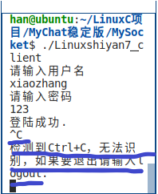

   代码实现：

   ```C
   void handler(int signo)               //捕获信号后的处理程序
   {
   	switch (signo)
   	{
   	case SIGINT:
   		printf("\n检测到Ctrl+C，无法识别，如果要退出请输入logout.\n");
   		break;
   	case SIGTSTP:
   		printf("\n检测到Ctrl+Z，无法识别，如果要退出请输入logout.\n");
   		break;
   	case SIGQUIT:
   		printf("\n检测到Ctrl+\\，无法识别，如果要退出请输入logout.\n");
   		break;
   	}
   }
   
   //并且在父子进程中都包含上以下语句,因为父子进程都会收到该信号，并且都屏蔽它。
   signal(SIGINT,SIG_IGN); 
   signal(SIGTSTP,SIG_IGN);
   signal(SIGQUIT,SIG_IGN);
   ```

   该实现通过调用Linux系统调用signal实现。并且从上述代码看客户端不仅屏蔽SIGINT(Ctrl+C)还屏蔽SIGTSTP(Ctrl+Z)以及SIGQUIT(Ctrl+\\)。

## 运行效果及说明

### 效果

一般情形下的运行结果：

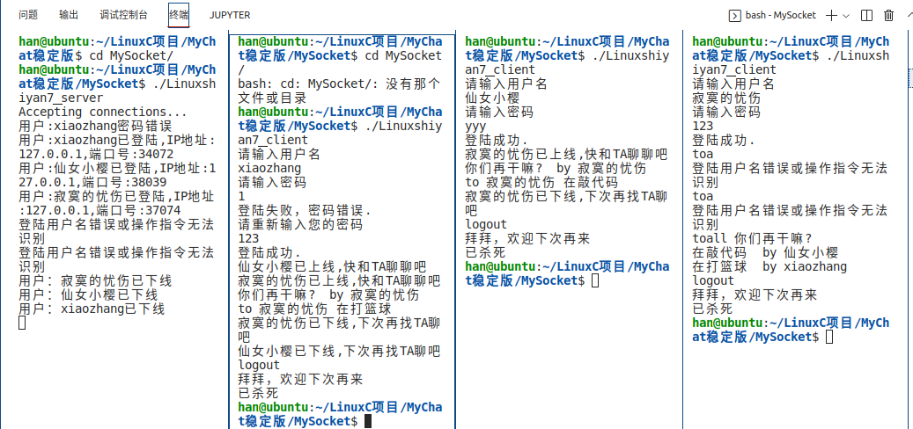

关于异常情况的处理（异地登陆、登陆异常、向不存在的用户转发...）:

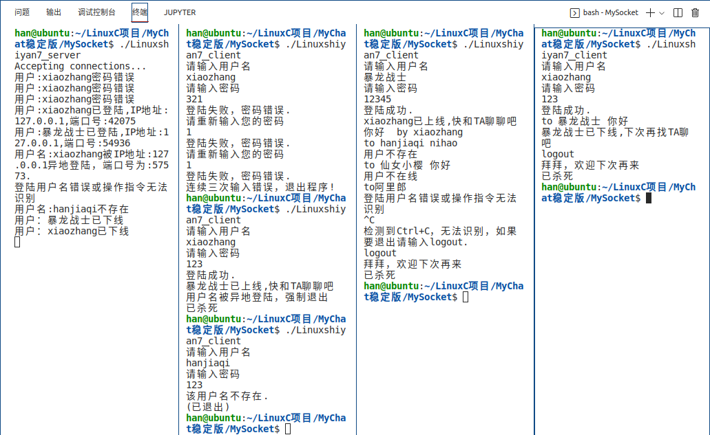

### 说明

如果服务端程序编译失败，不要慌，这是因为没有链接静态库pthread。由于服务端采用多线程处理，使用pthread头文件，所以服务端程序在编译需要链接上静态库pthread。

1. 如果在Linux使用命令窗口编译程序的话

   编译服务端程序使用指令`gcc -o xxx xxx.c -lpthread`编译即可

2. 如果使用Linux环境下的VScode

   在VScode会显示如下错误：
   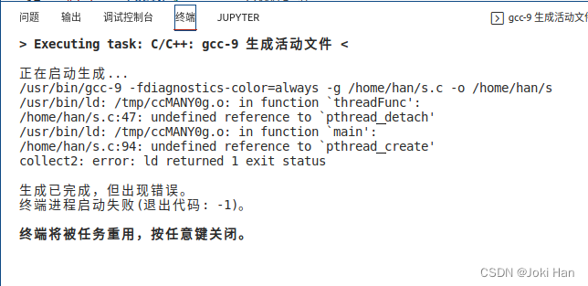

   解决方法：

   1. 将客户端和服务端程序放在文件夹里面，然后用VScode将其打开

   2. 打开.vscode中的tasks.json文件，按如下修改即可。
   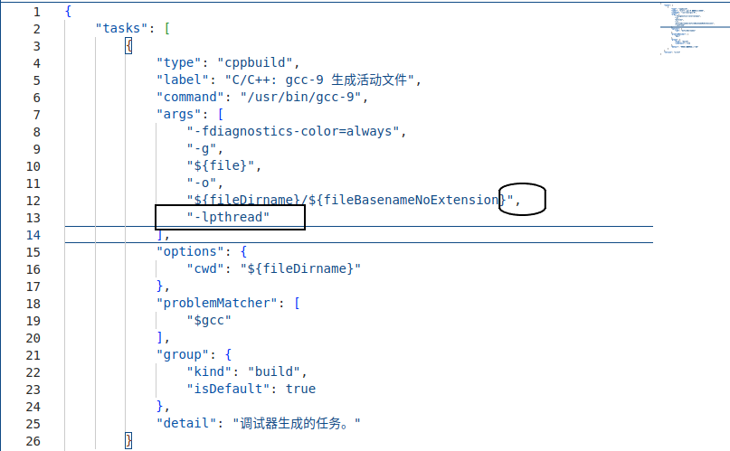

最后感谢[Gleko](https://github.com/GlekoMa)对我提供的一些技术方面的支持。

## 源代码

::: {.callout-note appearance="minimal"}
<i class="bi bi-journal-code"></i> [Download MySocket.zip](MySocket.zip){download="MySocket.zip"}
::: 

## 后记

第一次写博客，有一些地方处理的不是很好（照片不够清晰等等），请多多包涵。

这本是Linux编程老师留的作业，改装之后又作为计网专周实验。当然这个程序还不是最终版本，有时间我会继续维护，比如连接上数据库再加上界面窗口这些。所以本文将保持不定时更新。

---

<div style="text-align:right;">
[Joki](https://github.com/programingWarrior-xiaohan) \ 2022.7.18
</div>